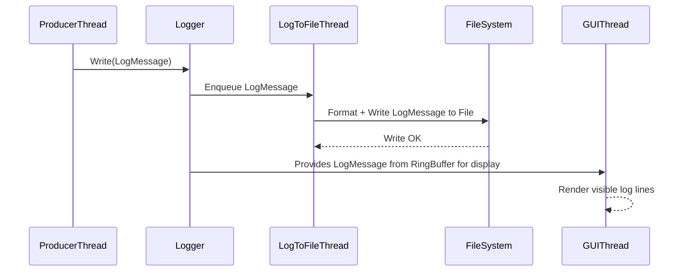

# Logger Documentation

## Overview

This logger system is designed for high-performance, thread-safe logging with asynchronous file output and efficient GUI rendering. It consists of three main components:

- **LogMessage**: Represents a single log entry, storing a log level, timestamp, and message text.
- **Logger**: The main interface for producing logs, which immediately queues `LogMessage`s for asynchronous processing.
- **LogToFile**: A background worker that dequeues `LogMessage`s, formats them, and writes them to a log file with rotation support.

---

## Components

### LogMessage

- Holds minimal data for a log entry:
  - `LogLevel` enum (Info, Warning, Error, Debug)
  - Timestamp as `std::chrono::system_clock::time_point`
  - Raw log message as `std::string`
- Methods designed for zero or minimal allocation:
  - `const char* FormatLevel() const`  
    Returns static string literals for log levels without dynamic allocation.
  - `void FormatTimestamp(char* outBuffer, size_t bufferSize) const`  
    Formats the timestamp directly into a provided character buffer (avoids `std::string` creation).
  - `std::string ToStringForFile() const`  
    Creates the final formatted log line string for file output by combining level, formatted timestamp, and message using `fmt::format`.

### Logger

- Provides a thread-safe `Write(const LogMessage&)` method that:
  - Pushes the log message into a thread-safe queue owned by `LogToFile`.
  - Does **not** perform any formatting or file I/O on the calling thread, ensuring minimal overhead.
- Allows multiple producer threads (e.g., application threads, GUI thread) to log concurrently without contention on file or formatting resources.

### LogToFile

- Owns a thread-safe queue of `LogMessage` objects.
- Runs a dedicated worker thread that:
  - Waits for new log messages.
  - Dequeues each `LogMessage`.
  - Calls `ToStringForFile()` on the message to format it **only when writing**.
  - Writes the formatted string to the log file.
  - Checks the file size to perform log rotation if necessary, preventing uncontrolled growth of log files and excessive disk usage, while still keeping a decent amount of history through backup files.
- This asynchronous design ensures that expensive string formatting and disk I/O do not block producer threads, maximizing performance.

---

## High-Level Workflow



---

## Performance Considerations

- **Minimal Data Copying:**  
  `LogMessage` stores raw message strings and lightweight enums. No early string formatting or copying is done on the producer side.

- **Efficient Timestamp Formatting:**  
  Timestamp formatting uses a fixed-size character buffer and system calls (`localtime_s` / `localtime_r`) directly, avoiding `std::string` overhead.

- **Static Log Level Strings:**  
  Log levels are converted to string literals returned as `const char*` with no heap allocations or string copies.

- **Asynchronous File I/O:**  
  Log messages are formatted **only once** by the background thread during writing, eliminating redundant string generation on multiple threads.

- **Thread-Safe Queue:**  
  Protects against race conditions while minimizing blocking time by unlocking mutexes during file writing.

- **Log Rotation:**  
  Manages file size limits and backup files transparently in the background thread, preventing I/O stalls on producer threads.

---

## Summary

This logger design achieves maximum runtime performance for the common case of producing log messages by offloading heavy formatting and disk writing to a dedicated thread. Producer threads experience minimal latency, allowing high-frequency logging without bottlenecks.

---

## Example Usage

### Direct LogMessage

```cpp
Logger::Write(LogMessage(LogLevel::Info, "This is a log message"));
```

This approach explicitly constructs a `LogMessage` and enqueues it quickly. The background thread asynchronously formats and writes it to disk, ensuring the application stays responsive.

### Recommended Macro Usage

To simplify logging and improve code readability, you can use predefined macros like:

```cpp
LOG_INFO("This is a log message");
LOG_ERROR("An error occurred: {}", errorCode);
```

These macros internally create `LogMessage` instances and forward them to the logger, providing a concise and efficient interface.

---

# License

MIT License
